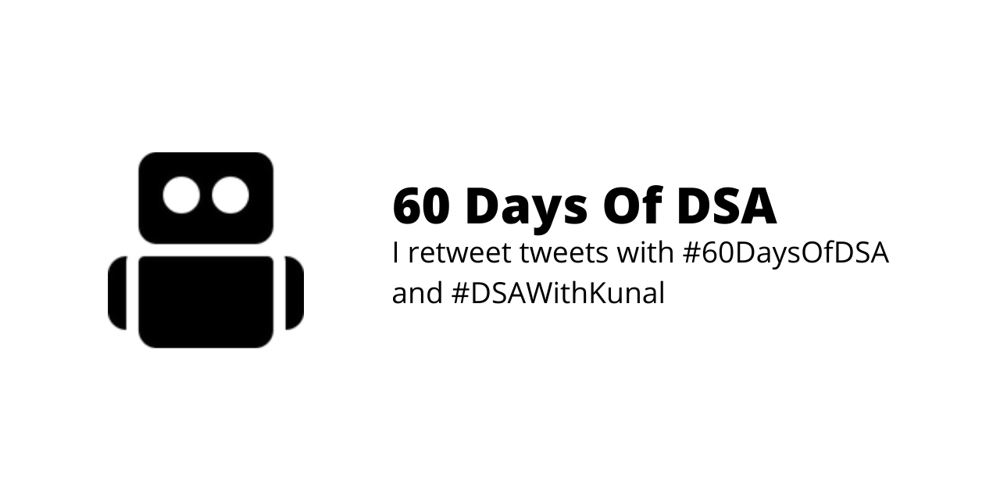

<!--
**shreemaan-abhishek/shreemaan-abhishek** is a ✨ _special_ ✨ repository because its `README.md` (this file) appears on your GitHub profile.

Here are some ideas to get you started:

- 🔭 I’m currently working on ...
- 🌱 I’m currently learning ...
- 👯 I’m looking to collaborate on ...
- 🤔 I’m looking for help with ...
- 💬 Ask me about ...
- 📫 How to reach me: ...
- 😄 Pronouns: ...
- ⚡ Fun fact: ...
-->

  

 
<h2 align="center">
  I'm Abhishek, aka 
    <a href="https://twitter.com/shreemaan_abhi"><i>shreemaan-abhishek</i></a>.
    I'm a passionate coder who loves building cool stuff.
     

<!--  -->
  

</h2>

<h3 align="center">
  I'm exploring web technologies as of now and I can guide you on Mobile Development, especially for Native Android Development. And... oh yea, here's my tagline:
</h3>
<h4 align="center" >
  <a href="https://stackoverflow.com/users/12980866/shreemaan-abhishek">
    <i> A geek, ambivert, and a workaholic person who thinks sarcasm is seriously important.</i>
  </a>
</h4>

## Tech Stack:
### Languages: 

### Database:

### Libs/Frameworks:

### Projects that I am proud of:
 

